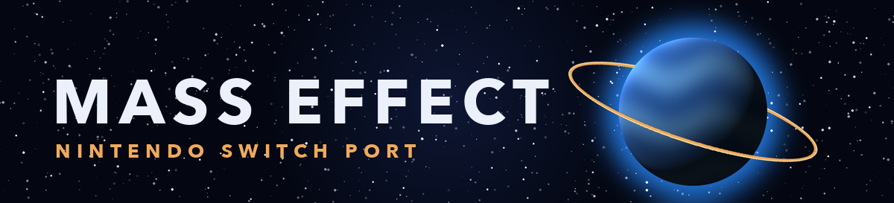

<div align=center>



</div>
<h1 align=center>Mass Effect — Nintendo Switch Port</h1>

An ahead-of-time static recompilation port of BioWare's sci-fi epic **Mass Effect** (Xbox 360, 2007) for the Nintendo Switch, by NebadasSwifty.

Rather than emulating the Xbox 360 hardware at runtime, the original PowerPC machine code in `default.xex` is statically translated into C++ using [ReXGlue](https://github.com/rexglue/rexglue-sdk) and compiled directly to native ARM64 (AArch64) code for Horizon OS. In-game rendering is handled by a custom Vulkan backend built on the open-source Mesa/NVK graphics driver. The game runs on **standard Switch hardware clocks with no overclock required**.

> [!WARNING]
> **Work-in-progress status & performance targets**
> The port is in active development. The prologue, Normandy deck exploration, Citadel wards, Mako planet exploration, dialogue trees, and combat encounters are fully playable. At stock console clock rates, the renderer averages roughly **25 FPS** at a native **960x544** scene buffer (ranging from ~20 FPS in foliage-heavy Eden Prime combat to 30+ FPS in interior Normandy/Citadel decks). Frame hitches during the initial visit to a new area subside once Vulkan pipelines are cached to the SD card. See [docs/performance-history.md](docs/performance-history.md) for profiling details and [docs/known-issues.md](docs/known-issues.md) for known limitations.

> [!NOTE]
> **Legal game files required**
> This repository contains no game assets, copyrighted audio, video, or textures. You must supply your own copy of the Xbox 360 disc: either an uncompressed image (`.iso` / `.xiso`), multi-disc images (Disc 1 + Disc 2), or an extracted folder structure with `default.xex`. Currently, supported releases include **Mass Effect (USA, Europe) (En,Es,Pl) (Rev 1)** and **Mass Effect (Russian Edition - 1C)** (supporting full Russian voiceover and text). Check [docs/editions.md](docs/editions.md) and [docs/russian-edition.md](docs/russian-edition.md) for edition hashes, setup details, and instructions for other regional releases.

## Installation

You can assemble your complete Switch installation package entirely in your desktop browser using the client-side installer: **https://nebadasswifty.github.io/masseffect-nx/** (available in English and Russian).

1. **Select game files:** Open the installer and point it to your Xbox 360 disc image (`.iso`) or extracted game directory (containing `default.xex`). For the Russian two-disc release choose **both** images (Disc 1 and Disc 2) together: the installer takes the intact copy of every file (Feros from Disc 1, Ilos and the ending from Disc 2) and checks every package.
2. **Build package:** Click **Create masseffect-nx.zip**. The browser unpacks Unreal Engine packages (`*.xxx`), translates Xenos microcode to SPIR-V shaders, bundles the Switch executable, and packages everything locally. **Nothing is uploaded to the internet.**
3. **Copy to SD card:** Extract the resulting `masseffect-nx.zip` into `sdmc:/switch/` so files reside in `/switch/masseffect-nx/`.
4. **Install launcher forwarder:** Download `masseffect-nx-forwarder.nsp` and install it via your preferred homebrew manager (DBI, Sphaira, etc.). Ensure your forwarder is configured for **39-bit address space** so the process receives full application memory.

### Folder Structure

```text
sdmc:/switch/masseffect-nx/
  ├── masseffect-nx.nro          (native game executable)
  ├── masseffect.toml           (runtime configuration file)
  ├── masseffect_prewarm_list.bin (pipeline prewarm list of your edition)
  ├── masseffect_shaders.mesp   (compiled SPIR-V shader library)
  ├── masseffect_shaders.mesp.idx (shader database index)
  └── game_root/                (your disc's files: default.xex, Layer0/, Layer1/)
```

> [!NOTE]
> **Incremental Updates:** When a new release of `masseffect-nx` is published, you do not need to re-copy the large ~7 GB `game_root/` folder. Simply open the installer page and select **Create masseffect-nx-update.zip**, which produces a lightweight zip containing only the updated binary, config, pipeline prewarm list and shader library.

> [!CAUTION]
> **Vulkan Pipeline Stutter:** When entering a new planet or graphical scene for the first time, brief stutter may occur while new Vulkan pipeline state objects are compiled by the Switch GPU driver. These pipelines are saved to the SD card and subsequent loads will be noticeably smoother.

## Controls & Key Mapping

Game controls map directly to Nintendo Switch inputs while matching on-screen UI prompts:

<div align="center">

| Switch Button | Action in Mass Effect | Xbox 360 Original |
| :--- | :--- | :--- |
| **A** | Interact / Confirm / Take Cover | A |
| **B** | Cancel / Exit / Storm (Sprint) | B |
| **X** | Draw & Holster Weapon / Reload | X |
| **Y** | First Aid (Medi-Gel) | Y |
| **ZR** | Fire Weapon / Vehicle Cannon | RT |
| **ZL** | Target Lock / Zoom / Vehicle Thruster | LT |
| **R** | Weapon Wheel (Pause Combat) | RB |
| **L** | Biotic & Tech Power Wheel (Pause Combat) | LB |
| **+** | System Menu / Pause | Start |
| **-** | Codex & Journal / Equipment | Back |
| **Left Stick** | Shepard Movement / Mako Steering | Left Stick |
| **Right Stick** | Camera Look / Turret Aim | Right Stick |
| **L3 (Click)** | Toggle Crouch | Left Stick Click |
| **R3 (Click)** | Scope Zoom Toggle | Right Stick Click |
| **D-Pad** | Squad Tactical Orders (Attack, Move, Regroup) | D-Pad |

</div>

- **Physical Xbox Button Mapping:** If you prefer physical layout (bottom button confirms, right button cancels), set `input_xbox_layout = true` in `masseffect.toml`.
- **Rumble Support:** Controller rumble can be enabled by setting `input_rumble = true` in `masseffect.toml`.

### In-Game Diagnostics Overlay

The SDK's own menus are opened with **L + R** held and a direction. With the debug overlay open, **L + R + right stick**
moves it, and while L and R are held the game does not see them or the right stick. The overlays also react to the
touch screen.

| Shortcut | Opens |
| --- | --- |
| L + R + Up | Debug overlay (counters and statistics) |
| L + R + Right | Settings: every setting with its value, and **Save to config** |
| L + R + Down | Log console |
| L + R + Left | Achievements |
| L + R + ZL | Starts the GPU A/B test lap (a measuring aid, not for playing) |

**Save to config** rewrites `masseffect.toml` with only the settings that differ from the program's built-in defaults,
and without the comments of the original file. Without saving, changes last until you close the game. A setting shown
as read-only (initialization only) needs a restart to change. Most settings of the SDK are for development and
debugging.

> [!NOTE]
> To see the FPS, the resolution and the clocks, use a console overlay such as Status Monitor or Horizon OC Monitor with
> SaltyNX installed: the port publishes its frame rate and resolution in the format those overlays read. The overlay's
> frame counter has been seen to freeze in some runs; the profiler log (`logs/rex/rex_profile.log`, written every
> 10 seconds next to the NRO) is the reliable source ([docs/measuring.md](docs/measuring.md)).

## Settings

`masseffect.toml`, next to the NRO, holds the settings. It is read at start-up and **every key is optional**: a missing
key keeps the default of the code. The file shipped with the port ([app/masseffect.toml](app/masseffect.toml)) is the
configuration that measured best on a stock-clock console, and each key is described there. The groups are:

- **Resolution:** `video_mode_width` and `video_mode_height` (the video mode the game believes it has),
  `masseffect_scene_width` and `masseffect_scene_height` (the internal render resolution), and `vsync`.
- **Input and audio:** `input_xbox_layout`, `input_rumble`, `audio_mute`.
- **Logging:** `log_level` and `log_async`. Logs are written to `sdmc:/switch/masseffect-nx/logs/`.
- **Performance:** the threading, command recording, per-draw cost, EDRAM and cache switches (`masseffect_*`). They exist
  to be measured one at a time; change them only to try something. Every idea and its measured result is in
  [docs/optimization-paths.md](docs/optimization-paths.md).
- **Startup movies:** `masseffect_coalesced_sha1`, only if you put a modified `Coalesced.ini` in `game_root` (see
  [tools/coalesced.py](tools/coalesced.py)).

## Resolution

The game always renders its scene at 1280x720 on the Xbox 360. The Switch GPU is one of the two limits of the port, so
the default configuration draws smaller and scales the finished frame to the screen:

- `video_mode_width = 960` and `video_mode_height = 540` make the game itself believe the screen is 960x540. It sizes its
  render targets from that, which keeps the emulation of the Xbox 360's EDRAM exact.
- `masseffect_scene_width = 960` and `masseffect_scene_height = 544` set the internal render resolution (viewport, scene
  targets, back buffer and the UI layout). The height is 544 and not 540 so the targets stay aligned to the Xbox 360's
  tiles (multiples of 16 pixels).

The internal resolution is the same in handheld and docked mode: it is not chosen from the dock state. Removing the
four keys restores the game's own 1280x720, which is sharper and slower. Resolutions off the tile grid (800x450, for
example) were measured as worse, and 1120x624 as about 6 FPS slower on the same route (see
[docs/performance-history.md](docs/performance-history.md)).

## Performance and clocks

The port is made to run at the console's stock clocks with **no overclock**. It changes nothing in the system
configuration and uses no sysmodule: the only request it makes to the system is the official GPU performance
configuration through Horizon's own API.

<div align="center">

| Mode | CPU | GPU | Memory |
| --- | --- | --- | --- |
| Handheld | 1020 MHz | 460.8 MHz (the official Nintendo handheld profile, requested at start-up) | 1331.2 MHz |
| Docked | 1020 MHz | 768 MHz (system default) | 1600 MHz (system default) |

</div>

The CPU is what limits the port most: the game runs on three cores (the fourth belongs to the system) and its main
thread alone needs about 30 ms per frame. The two sources that disagree on the exact GPU clock are discussed in
[docs/performance-history.md](docs/performance-history.md), under "Where the sources disagree"; you can read the real
clocks from the profiler log of your own run ([docs/measuring.md](docs/measuring.md)).

> [!WARNING]
> **Do not use the official CPU boost mode** (`masseffect_cpu_boost`, off by default). While it is on, the system
> throttles the GPU to 76.8 MHz, and the game drops to 3-4 FPS.

Overclocking tools are not needed and the port is not tuned for them. Overclocking pushes the console beyond what it was
designed for and is done at your own risk.

## How it works

- **The game's code is translated, not emulated.** ReXGlue translates every function of the game's program
  (`default.xex`) to C++, which is then compiled for the Switch. ReXGlue also gives the game what it expects from an Xbox
  360: its system, files, audio and controllers. This port adds the Switch part: memory, threads, crash handling,
  clocks, audio output and showing the frames on screen.
- **Its own renderer.** The game keeps its own Direct3D layer, which writes a list of GPU commands. The port reads that
  list and draws the same frame with Vulkan, and it imitates the Xbox 360's 10 MB of EDRAM with one image per format.
  The busiest game functions run as native code, each one checked against the original.
- **Shaders translated beforehand.** The game's GPU programs are found in its Unreal packages, translated with
  [XenosRecomp](https://github.com/hedge-dev/XenosRecomp) and DXC into one library file, `masseffect_shaders.mesp`.
- **Its own graphics driver.** Vulkan runs on NVK, from the Mesa project, through
  [mesa-switch](https://github.com/danfromtico/mesa-switch), with this port's changes in `mesa/`: shader compiler
  scheduling fixes, per-stage shader cache keys and cheaper draws.
- **Optimization.** The code generator keeps the Xbox 360 registers in host registers, the CPU cost of each draw is cut
  down, and the GPU time per frame is reduced by proving that many transfers are unnecessary. Link-time optimization,
  profile-guided optimization and function ordering were built and measured, and gave no measurable gain, so they are
  off or not shipped (see [docs/toolchain.md](docs/toolchain.md)).

## Documentation

For anyone porting another Xbox 360 game, or curious about how this one was done. **Start with
[docs/README.md](docs/README.md)**: it explains in six steps how the whole port fits together, and what to read for what
you want to do. Every technical word is explained in the [glossary](docs/glossary.md).

<div align="center">

| Document | What it explains |
| --- | --- |
| [docs/glossary.md](docs/glossary.md) | Every technical word, in plain words |
| [docs/building.md](docs/building.md) | How to build the code generator, the NRO, the driver and the shader library, step by step |
| [docs/porting-another-game.md](docs/porting-another-game.md) | What you can reuse for another game, and in which order to work |
| [docs/native-renderer.md](docs/native-renderer.md) | How the port draws the game with Vulkan |
| [docs/shaders.md](docs/shaders.md) | How the game's shaders are translated, and what had to be fixed |
| [docs/toolchain.md](docs/toolchain.md) | How the game's code is translated and compiled, and the build options |
| [docs/mesa.md](docs/mesa.md) | The graphics driver and this port's changes to it |
| [docs/platform-notes.md](docs/platform-notes.md) | Things about the Switch system that cost a lot of time to find out |
| [docs/audio-and-video.md](docs/audio-and-video.md) | The game's audio and movies on the Switch |
| [docs/editions.md](docs/editions.md) | How the supported edition is identified, and how to add another |
| [docs/russian-edition.md](docs/russian-edition.md) | How the Russian release (1C) is supported, audio mapping, and multi-disc setup |
| [docs/measuring.md](docs/measuring.md) | How to measure performance on the console without being misled |
| [docs/performance-history.md](docs/performance-history.md) | How the frame rate went from a few FPS to about 25, step by step |
| [docs/optimization-paths.md](docs/optimization-paths.md) | Every optimization idea tried, with its result |
| [docs/known-issues.md](docs/known-issues.md) | What is not working, not finished or not proven |

</div>

## Build

Docker (the `devkitpro/devkita64` image is used for the Switch build), CMake, Ninja, Python 3, a C++ compiler for your
computer to build the code generator (macOS or Linux), the Vulkan driver built from
[mesa-switch](https://github.com/danfromtico/mesa-switch) with `mesa/mesa-switch-masseffect.patch`, and your own copy of
the game for the code generator. The whole process is in [docs/building.md](docs/building.md). The short version:

```sh
python3 tools/extract_iso.py "Mass Effect.iso"
tools/build_host.sh
tools/codegen.sh
mesa/build_mesa_docker.sh          # an hour or more, once
tools/build_nro.sh
```

<div align="center">

| Folder | Contents |
| --- | --- |
| `app/` | The game: hooks, native renderer, audio hooks, configuration, code generator settings, CMake project |
| `sdk/` | ReXGlue SDK with the Horizon (Switch) layer and the code generator changes |
| `shaders/` | XenosRecomp with this port's changes, the shader library tools and their WebAssembly builds |
| `mesa/` | The patch for mesa-switch and the scripts that build the driver |
| `tools/` | Code generation steps, build scripts, analysis tools, console test scripts |
| `tests/` | Standalone tests of the port's logic (no console, no game files) |
| `installer/` | The installer web page |
| `docs/` | Documentation |
| `extras/` | The banner and the icon |

</div>

There is no `pgo/` folder: the profile used for profile-guided optimization is **not shipped**, because that
optimization gave no measurable gain (see [docs/toolchain.md](docs/toolchain.md) for how to generate a profile).

## Known issues

The short list: about 25 FPS instead of 30, dips in a cold start, slow start-up, and one known picture problem (the
planet behind the title screen is black while the camera pans to the main menu). Everything, with the evidence, is in
[docs/known-issues.md](docs/known-issues.md).

## Credits & Acknowledgments

- **BioWare and Electronic Arts** — Creators of Mass Effect. This is an unofficial, non-commercial fan-made port with no affiliation.
- **[StevensND](https://github.com/StevensND)** — Creator of [NFSMW-NX](https://github.com/StevensND/NFSMW-NX), whose pioneer work on running statically recompiled Xbox 360 games on Nintendo Switch (including the Horizon OS runtime integration, Mesa/NVK driver adaptations, and browser-based shader compilation workflows) served as foundational inspiration and technical reference. *(Note: StevensND is not affiliated with, endorsing, or responsible for this Mass Effect port).*
- **[madelrandel-blip](https://github.com/madelrandel-blip/NFSMW-Recompiled)** — NFSMW Recompiled, the recompilation project this port started from (the application hooks, configuration, code generator setup and tools).
- **[Tom Clay](https://github.com/rexglue/rexglue-sdk)** — The ReXGlue SDK, built on the research of the **[Xenia](https://xenia.jp)** team.
- **[hedge-dev](https://github.com/hedge-dev/XenosRecomp)** — XenosRecomp, the Xenos shader translator.
- **[danfromtico](https://github.com/danfromtico/mesa-switch)** and **[NaGaa95](https://github.com/NaGaa95/mesa-switch)** — mesa-switch: Mesa, NVK and NAK on Horizon OS.
- **[devkitPro](https://devkitpro.org)** and **[switchbrew](https://github.com/switchbrew/libnx)** — devkitA64 and libnx.
- All third-party libraries listed in [THIRD_PARTY_NOTICES.md](THIRD_PARTY_NOTICES.md).

## Support

Bug reports and measurements are welcome on the [issues page](https://github.com/NebadasSwifty/masseffect-nx/issues).
Before you open one, read [CONTRIBUTING.md](CONTRIBUTING.md): it says what to include (console model, firmware, the
newest log and your `masseffect.toml`) and what never to attach (game files and anything made from your disc).

## Legal

No affiliation with Electronic Arts or BioWare. "Mass Effect" is a trademark of Electronic Arts Inc. This repository
contains no assets or program code from the original game. Users must provide their own legally obtained copy, and the
installer page makes the package from it on their own computer. Running homebrew requires custom firmware, which
violates Nintendo's terms of service and can get a console banned: your call.

Copyright (c) 2026 NebadasSwifty. Source code is provided under the GPL-3.0 License (see [LICENSE](LICENSE)), which the
port inherits from the project it started from. The SDK changes are under the SDK's BSD-3-Clause license, and the shader
translator and Mesa changes under MIT, so other ports can reuse them (see [THIRD_PARTY_NOTICES.md](THIRD_PARTY_NOTICES.md)).

## Automated releases

GitHub Actions packages the NRO, NSP launcher and SD starter ZIP, then deploys the browser installer to GitHub Pages.
See [docs/releases.md](docs/releases.md) for local publishing and the optional private runner for NRO builds.
